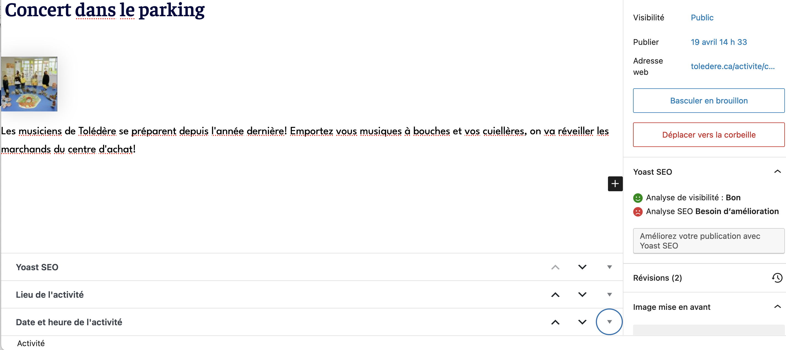

# Tolédère - documentation

Pour l'artiste Dominic Lafontaine

## Dépendances et configurations:
CMS: WordPress 6.5.2\
Theme : Astra (wp)

### Librairies: 
- Leaflet
- Vanilla Calendar

### Plugins WP:
- Yoast
- Wordefence

## Ajout de contenu et gestion des pages

Ce document fournit un guide aux administrateurs sur la façon d'ajouter du contenu et de gérer les pages dynamiques du site web.

### 1. Ajout d'articles personnalisés

Il existe trois principaux types d'articles personnalisés :




#### **Calendrier d’activités:** 
Ces articles sont utilisés pour ajouter des activités au calendrier. En créent une activité, et s’ajoute à la page “calendrier” et, elle aura une page a elle, qui sera accordé une adresse avec la logique suivante : https://www.toledere.ca/nom-de-l'activite

**Ajout d'un nouvel activité:**
1. Accédez au tableau de bord d'administration de WordPress.
2. Allez dans **Calendrier d’activités** > **Ajouter un article**.
3. Vous verrez une interface d'édition familière ressemblant aux articles WordPress par défaut. Cependant, il peut y aura deux champs personnalisés supplémentaires, en bas de la page.
4. Remplissez le titre, et le contenu (pour la description de l’activité)
5. Une image n’est pas nécessaire, mais embellira la présentation. Celle ci peut être ajouté dans la section du contenu. 
6. Remplir la section pour le lieu de l’évènement:
	- En décochant la case “lieu custom” vous pourrez sélectionner parmi les lieux que vous avez déjà crée. Notez que les champs associés au lieux sauvegardé seront visible mais non-interactif (grisé), et le champ de description du lieu sera en html, mais ceci n’aura pas d’impact sur ce que verra l’utilisateur une fois l’article publié. 
	- En cochant la case “lieu custom”, vous pourrez créer un lieu à usage unique. Pour géo-localiser l’évènement, il suffit de cliquer sur la carte. Notez que la carte n’est pas centralisé. On peut la glisser à l’endroit où on veut, OU on peut régler le bug en ajustant la taille de la fenêtre du navigateur.  
7. Remplissez aussi la section, qui devrait se trouver directement en dessous, pour la date et l’heure de l’activité. **Attention** une activité qui n’est pas donné une date ne sera pas ajouté à la page du calendrier.
8. Publiez l'article.

 **Lieux d’activités:** 
 Ces articles sont utilisés pour ajouter des lieux réutilisables, qui sont accessible à partir d’une boite de selection dans la creation d’une article de type “calendrier d’activité”.

**Ajout d'un nouveau lieu:**
1. Accédez au tableau de bord d'administration de WordPress.
2. Allez dans **Lieux d’activités** > **Ajouter un article**.
3. Vous verrez une interface d'édition familière ressemblant aux articles WordPress par défaut. Cependant, il peut y aura un champ personnalisé supplémentaire, en bas de la page.
4. Remplissez le titre (pour le nom du lieu), et le contenu (pour la description du lieu). 
5. Pour géo-localiser l’évènement, il suffit de cliquer sur la carte. Notez que la carte n’est pas centralisé. On peut la glisser à l’endroit où on veut, OU on peut régler le bug en ajustant la taille de la fenêtre du navigateur. 
6. Il y a aussi un champ pour l’adresse. 
7. Publiez l'article.

 **Plaintes et Requêtes:** 
 Ces articles sont utilisés pour faire le suivi des plaintes et requêtes déposés par le public.

**Consulter les plaintes et requêtes:**
1. Accédez au tableau de bord d'administration de WordPress.
2. Allez dans **Plaintes et requêtes** > **Toutes les plaintes**.
	
### 2. Gestion d’autre contenu dynamique

 **Urgence en marquee:** 
 Le message d’urgence qui défile en haut de la page d’accueil est crée dynamiquement à partir du dernier article publié  qui a la catégorie “Urgence”. 
 
 **Ajout d'une nouvelle urgence:**
1. Accédez au tableau de bord d'administration de WordPress.
2. Allez dans **Articles** > **Ajouter un nouvel article**.
3. Vous verrez une interface d'édition familière ressemblant aux articles WordPress par défaut.
4. Remplissez le titre (le titre est pour vous—il n’apparaitra pas sur le site).
5. Remplissez le contenu, celui-ci sera combiné avec l’introduction: “[date d’aujourd’hui] Avis important:” et défilera en haut de la page d’accueil, si c’est l’article la plus récente avec la catégorie “Urgence” à être publié. 
6. **Pré-programmer des messages:** Notez que vous pouvez pré-programmer des changements de message en changeant la date et l’heur de publication dans le panneau à droite. En sauvegardant une date de publication future, vous assurer qu’à l’heure de publication, le message changera. 
7. **Vitesse du défilement:** Notez que la longueur de l’article pourrait avoir un effet sur la vitesse à laquelle l’article défile. Trop long, et l’article défilera trop lentement. Trop court, et l’article défilera trop vite. 

`
code
`
```
fullcode
```
### 3. Gestion de contenu statique
 **Les menus:** 
Il y a trois menu, ceux si sont accessible et modifiable depuis le système WordPress/Astra. 
1. Menu hamburger (le menu en haut de la page, en format mobile). La structure des liens est à trois niveaux.
2. Menu plein écran (reprend les mêmes liens que le menu hamburger, mais avec une structure à deux niveaux). Il y a aussi du CSS ajouté sur ces lien à partir du système WordPressAstra.
3. Menu pied de page.

 **La page d’accueil:** Les éléments modifiables à partir du système WordPress/Astra sont
1. Image en haut de l’écran, avec texte.
2. Barre d’information sur Tolédère.
3. Un mot du maire. (lien vers l’article “un-mot-du-maire” sur l’image).
4. Menu pied de page.
5. Témoignage.
6. Visiter Tolédère (liens vers des ancres dans l’article “visiter-toledere” sur chaque image)
